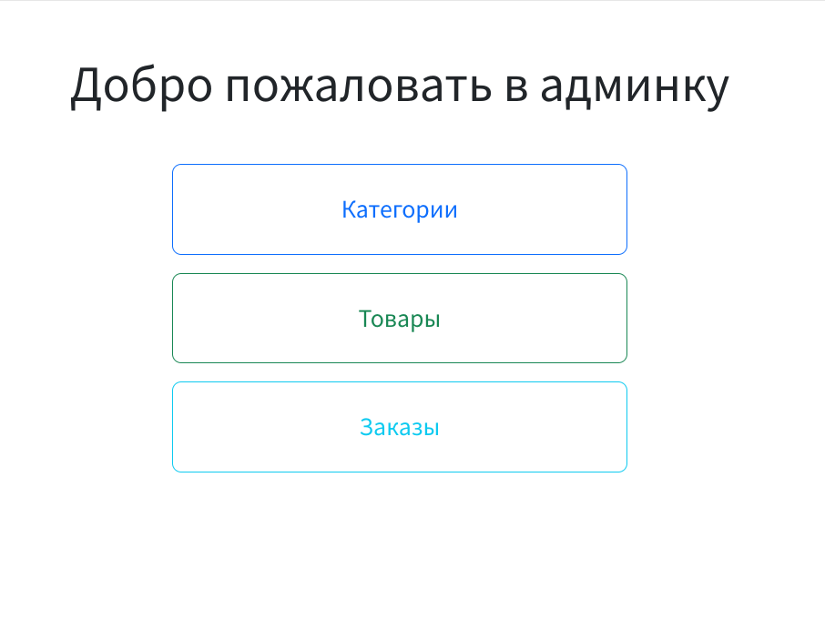
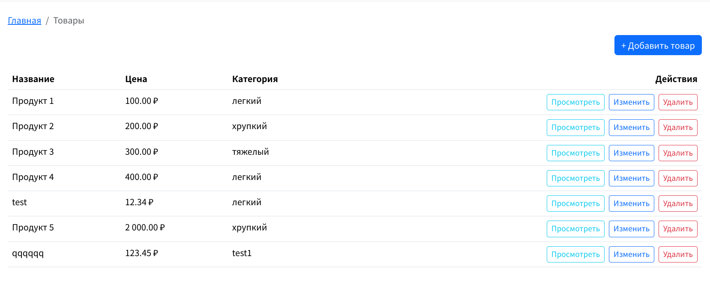
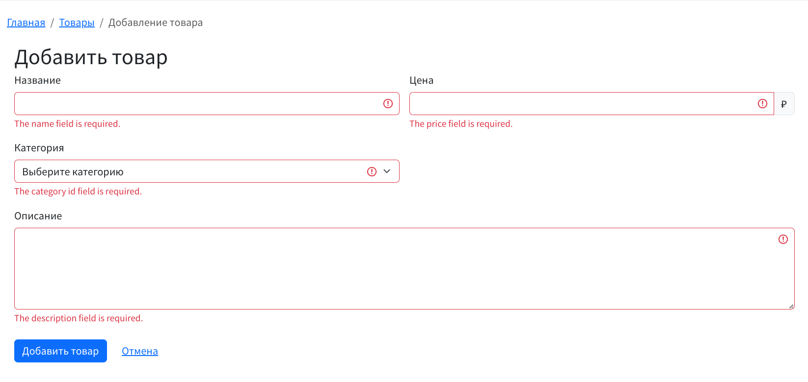
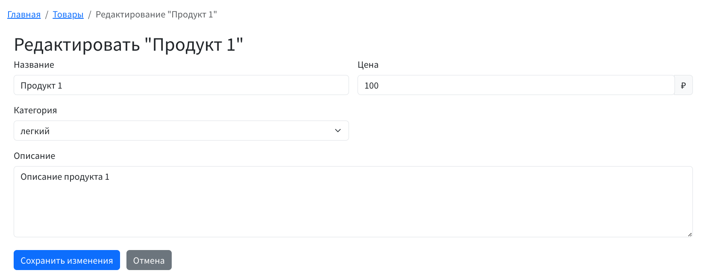
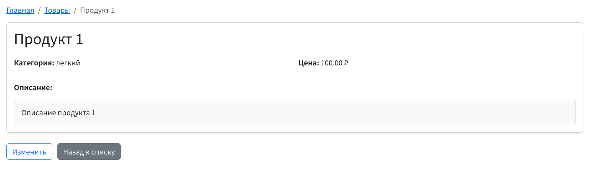
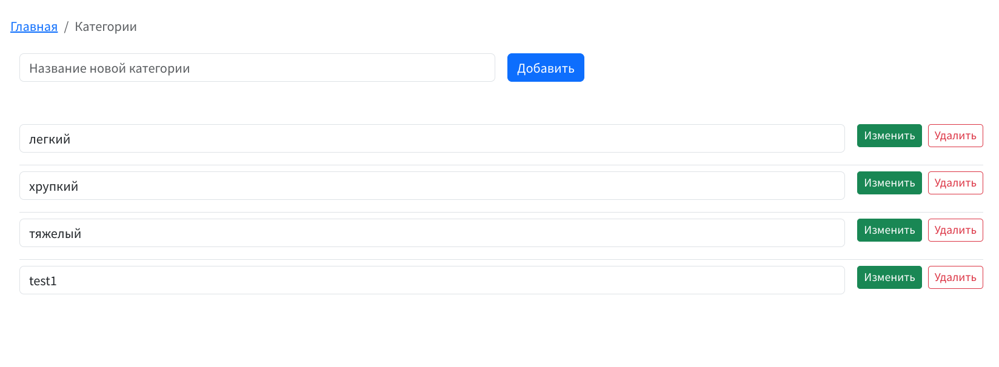
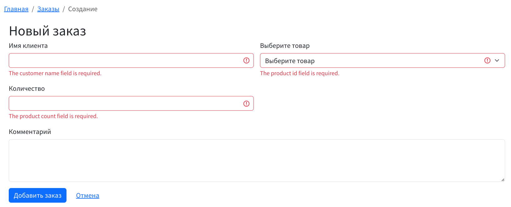
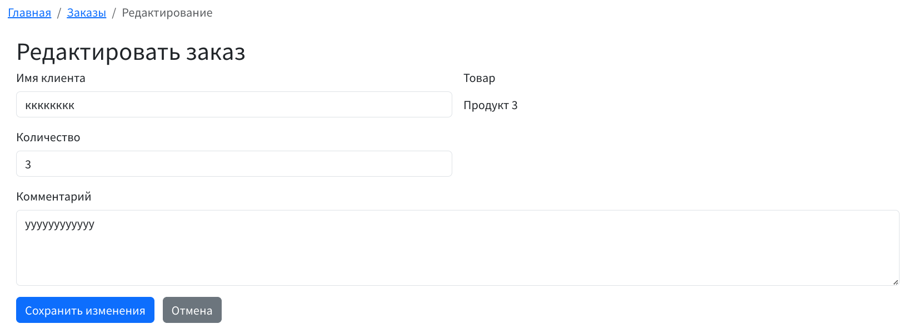
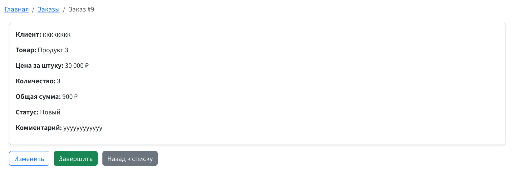
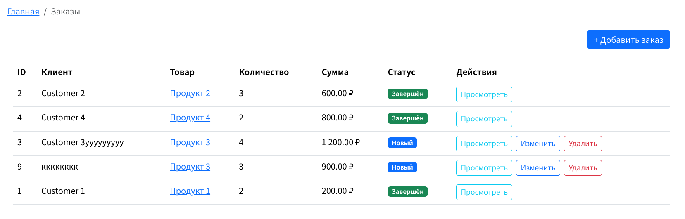

# Store Manager

Store Manager — это веб-приложение для управления товарами, категориями и заказами в интернет-магазине. Оно разработано на базе фреймворка Laravel и предоставляет удобный интерфейс для администрирования данных.

## Скриншоты












## Возможности

- **Управление товарами**: добавление, редактирование, удаление, просмотр.
- **Категории**: создание, изменение, удаление.
- **Заказы**: оформление, редактирование статуса, просмотр деталей.
- **Валидация**: проверка данных при создании/редактировании сущностей.
- **Миграции и сидеры**: готовые миграции и тестовые данные для быстрого старта.

## Технологии

- [Laravel 9.x](https://laravel.com/docs/9.x)
- PHP 8.3
- PostgreSQL
- Docker / Docker Compose
- Blade templates

## Установка

### Предварительные требования

- Docker и Docker Compose установлены
- Git
- Composer

### Шаги установки

1. Клонируйте репозиторий.

2. Запустите контейнеры:
   ```bash
   docker-compose up -d
   ```

3. Установите зависимости:
   ```bash
   docker-compose exec app composer install
   ```

4. Сгенерируйте ключ приложения:
   ```bash
   docker-compose exec app php artisan key:generate
   ```

5. Выполните миграции и заполните тестовые данные:
   ```bash
   docker-compose exec app php artisan migrate --seed
   ```

6. Откройте приложение по адресу `http://localhost`.

## Использование

- Перейдите на главную страницу и воспользуйтесь ссылками для навигации по разделам.
- Добавляйте/редактируйте/удаляйте товары, категории и заказы через соответствующие формы.

## Структура проекта

Проект состоит из следующих основных частей:

- **Controllers**: обработка HTTP-запросов (`CategoriesController`, `ProductsController`, `OrdersController`).
- **Models**: модели данных (`Category`, `Product`, `Order`).
- **Requests**: валидация входящих данных (`SaveCategoryRequest`, `SaveProductRequest`, `SaveOrderRequest`).
- **Views**: шаблоны Blade для отображения данных.
- **Migrations**: SQL-скрипты для создания таблиц.
- **Seeders**: тестовые данные для начального заполнения БД.

## Лицензия

Проект использует лицензию [MIT]
